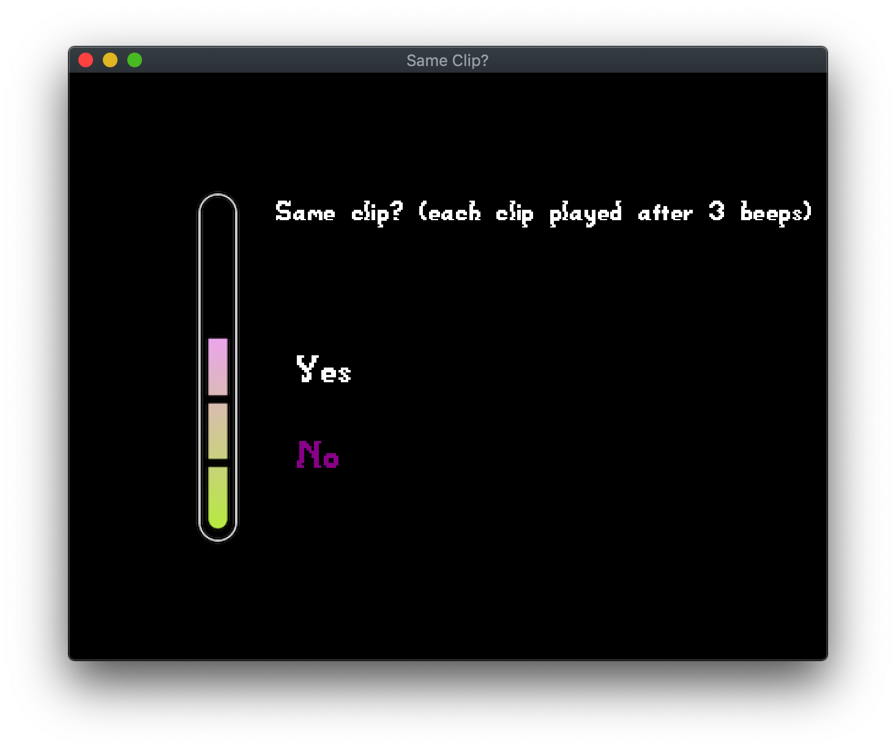

# Same Clip?

Author: Haomin Wang (haominw)

Design: This is a game for players to discriminate the minor difference between sound clips.
For each round, two same clips or two clips with slight difference will be played after 3 beeps.
Players need to listen carefully adn then decide whether the two clips are the same.

Screen Shot:

How To Play:

Press UP/DOWN keys to switch between options. Press ENTER to make your choice.
Each correct choice will gain you 1 point. 
Each wrong choice will make you lose 1 point.
You need 5 points to win the game. 

Sources:
I used some royalty-free loops of Apple's GarageBand to make these clips.
GarageBand copyright explanation link: https://support.apple.com/en-us/HT201808

Also, Anying Zheng (andrew ID: anyingz), my girlfriend who is not taking this class,
helped me and taught me how to use GarageBand/Sketch to make the sounds/artwork I needed.

This game was built with [NEST](NEST.md).
